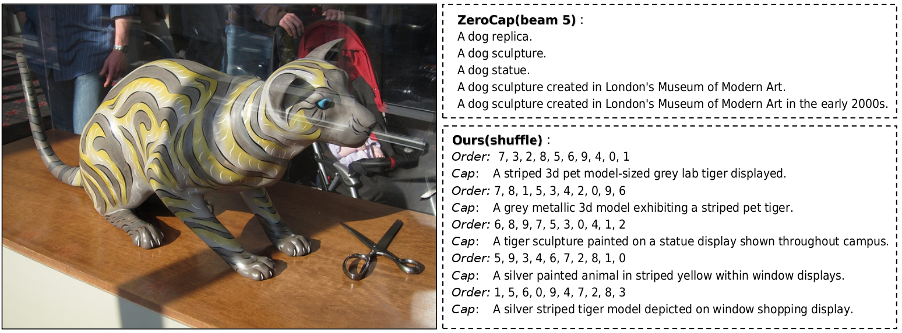
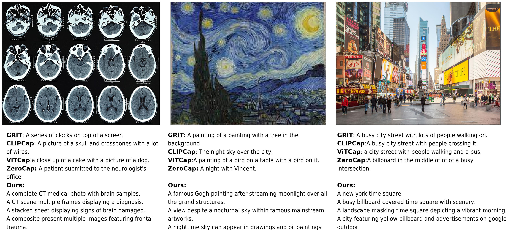

# Pytorch Implementation of [ConZIC: Controllable Zero-shot Image Captioning by Sampling-Based Polishing](https://arxiv.org/abs/2303.02437) [CVPR 2023]

### Framework


### Example of length control


### Example of sentiment control


### Example of part-of-speech control


### Example of diverse captioning


### Example of various image styles with world knowledge



## DEMO

### To run zero-shot captioning on images:
ConZIC supports arbitary generation orders by change **order**. You can increase **alpha** for more fluency, **beta** for more image content. Notably, there is a trade-off between fluency and image-matching degree.  
**Sequential**: update tokens in classical left to right order. At each iteration, the whole sentence will be updated.
```
python run.py --run_type "caption" --order "sequential" --sentence_len 10 --caption_img_path "./examples" 
--lm_model "bert-base-uncased" --match_model "clip-vit-base-patch32" 
--alpha 0.02 --beta 2.0
```
**Shuffled**: update tokens in random shuffled generation order, different orders resulting in different captions.
```
python run.py --run_type "caption" --order "shuffle" --sentence_len 10 --caption_img_path "./examples" 
--lm_model "bert-base-uncased" --match_model "clip-vit-base-patch32" 
--alpha 0.02 --beta 2.0
```
**Random**: only randomly select a position and then update this token at each iteration, high diversity due to high randomness. 
```
python run.py --run_type "caption" --order "random" --sentence_len 10 --caption_img_path "./examples" 
--lm_model "bert-base-uncased" --match_model "clip-vit-base-patch32" 
--alpha 0.02 --beta 2.0
```

### To run controllable zero-shot captioning on images:
ConZIC supports many text-related controllable signals. For examples:  
**Sentiments(positive/negative)**: you can increase **gamma** for higher controllable degree, there is also a trade-off.
```
python run.py 
--run_type "controllable" --control_type "sentiment" --sentiment_type "positive"
--order "sequential" --sentence_len 10 --caption_img_path "./examples" 
--lm_model "bert-base-uncased" --match_model "clip-vit-base-patch32" 
--alpha 0.02 --beta 2.0 --gamma 5.0
```
**Part-of-speech(POS)**: it will meet the predefined POS templete as much as possible.
```
python run.py 
--run_type "controllable" --control_type "pos" --order "sequential"
--pos_type "your predefined POS templete"
--sentence_len 10 --caption_img_path "./examples" 
--lm_model "bert-base-uncased" --match_model "clip-vit-base-patch32" 
--alpha 0.02 --beta 2.0 --gamma 5.0
```
**Length**: change **sentence_len**.

### Citation
Please cite our work if you use it in your research:
```
@article{zeng2023conzic,
  title={ConZIC: Controllable Zero-shot Image Captioning by Sampling-Based Polishing},
  author={Zeng, Zequn and Zhang, Hao and Wang, Zhengjue and Lu, Ruiying and Wang, Dongsheng and Chen, Bo},
  journal={arXiv preprint arXiv:2303.02437},
  year={2023}
}
```


**Acknowledgment:** This code is based on the [bert-gen](https://github.com/nyu-dl/bert-gen) and [MAGIC](https://github.com/yxuansu/MAGIC). 


